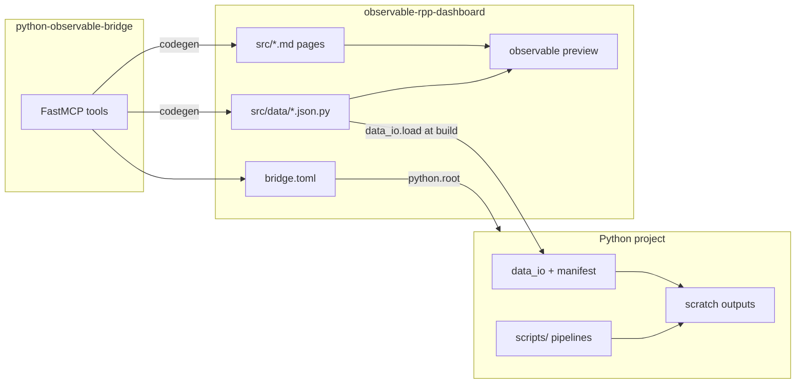

# Observable Framework bridge (deferred plan)

**Status:** deferred — architecture sketched; wait for a concrete Observable viz idea before building  
**Applies to:** DH projects with `data_io` + manifest-backed pipelines (pilot: `gnb_analysis` RPP)  
**Portable:** yes

## Summary

Bridge a Python `data_io` project to an **Observable Framework** dashboard via two separate repos and a `bridge.toml` config. The Python project produces data; the dashboard repo owns viz and wiring. An optional MCP server helps agents codegen data loaders and pages.

Use **Observable-native** charts (Plot, Inputs, etc.) — not matplotlib ports.

## Repo model

Three sibling repos:

| Repo | Role |
|------|------|
| Python project (e.g. `gnb_analysis`) | Pipelines, `data_io`, `data_manifest.toml` — **no viz code** |
| `observable-rpp-dashboard` (new) | Framework pages, components, `.json.py` data loaders |
| `python-observable-bridge` (new) | FastMCP server for loader/page codegen |

**Wiring principle:** the dashboard repo owns `bridge.local.toml`. The Python project stays unaware of Observable except for datasets it already produces.



## Wiring contract (`bridge.toml`)

Dashboard repo ships `bridge.toml.example`. Copy to `bridge.local.toml` (gitignored):

```toml
[python]
root = "/path/to/gnb_analysis"
interpreter = "uv run python"

[framework]
root = "."
data_dir = "src/data"

[datasets]
include_prefixes = ["president_", "rpp_"]

[limits]
max_preview_rows = 5000
max_tool_response_bytes = 65536
```

**Python project must provide:**

1. `data_manifest.toml` at `python.root`
2. Vendored `data_io` importable from that root
3. Registered logical names for consumed datasets
4. Scratch tier mounted (or `data_manifest.local.toml` fallback) when running preview

**Dashboard repo provides:**

1. Framework pages and JS components
2. `.json.py` loaders calling `data_io.load(logical_name)` — never hardcoded paths
3. `bridge.local.toml` linking to the Python project

Example loader:

```python
#!/usr/bin/env -S uv run python
import json, os, sys
from pathlib import Path

PYTHON_ROOT = Path(os.environ.get("BRIDGE_PYTHON_ROOT", "{{python_root}}"))
sys.path.insert(0, str(PYTHON_ROOT))
os.chdir(PYTHON_ROOT)

from data_io import load
print(json.dumps(load("president_rotation_18c")))
```

Set `BRIDGE_PYTHON_ROOT` in `package.json` preview/build scripts (or a `scripts/with-bridge-env.sh` wrapper).

## Pilot scope (gnb_analysis RPP)

**First datasets** (small JSON on scratch — good for `.json.py` loaders):

- `president_rotation_18c`, `president_rotation_1610`, `president_rotation_1626`
- `rpp_summary`

**First viz ideas** (pick when ready — Observable-native, not matplotlib ports):

- President rotation explorer (transition counts from `analyze_presidents.py`)
- RPP matrix inventory cards from `rpp_summary`

**Deferred (v2+):**

- Full `rpp_18c` explorer (25k × 860 parquet — needs derived long-format export first)
- Timelines, heatmaps, passport vs presence comparison

## Implementation phases

| Phase | Work | Effort |
|-------|------|--------|
| **0 — Smoke test** | Scaffold dashboard repo, one hand-written loader, `observable preview` | ~½–1 day |
| **1 — First viz** | Observable-native chart when concrete idea surfaces | ~1–2 days |
| **2 — MCP server** | `check_bridge`, `list_datasets`, `generate_data_loader`, `generate_page` | ~1–2 days |
| **3 — Docs** | READMEs in both new repos; optional pointer in Python project's `docs/VIZ.md` | ~½ day |

Phase 0 alone validates the architecture. MCP and second page can wait.

## MCP setup (when built)

```json
{
  "mcpServers": {
    "observable-bridge": {
      "command": "uv",
      "args": [
        "run",
        "--directory", "/path/to/python-observable-bridge",
        "observable-bridge",
        "--config", "/path/to/observable-rpp-dashboard/bridge.local.toml"
      ]
    }
  }
}
```

## Constraints

| Constraint | Implication |
|------------|-------------|
| Scratch tier on external SSD | Preview fails if unmounted — surface via `check_bridge()` |
| Pre-1678 dates | Export ISO strings from `pd.PeriodIndex`; no `datetime` in JSON |
| Wide RPP parquets | Never load wholesale; use `rpp_summary` or derived exports |
| Manifest discipline | Loaders use `data_io.load(logical_name)` only |

## Wiring other projects

1. Edit `bridge.local.toml` → new `python.root`
2. Align manifest logical names (or update loader names)
3. Run `check_bridge()` via MCP

For a different domain: fork the dashboard repo, reuse the same MCP server.

## Success criteria

1. Dashboard previews a viz fed by live `data_io` loaders — no files inside the Python project
2. Rewiring = editing `bridge.local.toml` only
3. Pipeline re-run → preview reload shows updated data

## Related

- [manifest-discipline](manifest-discipline.md)
- [archivist-vs-data-io](archivist-vs-data-io.md)
- RPP add-on: `addons/rpp/`
- Pilot data project: `gnb_analysis`
